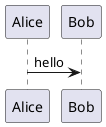
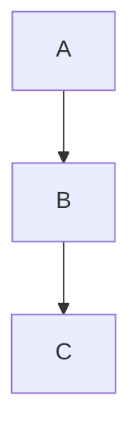

# diagram-render

Renders diagram source files to PNG using [Kroki](https://kroki.io). No runtime dependencies — uses only Node.js built-ins.

Two input modes:

- **Individual files** — one diagram per file, format detected from extension
- **Markdown files** — multiple diagrams embedded as fenced code blocks in a single `.md` file, each rendered to a sub-directory

## Quick start

```bash
# Drop source files into src/ then render all of them
npm run render
```

Output PNGs land in `diagrams/`.

## Usage

```bash
node generate.cjs [file] [options]
```

| Argument / Option    | Description                            | Default      |
|----------------------|----------------------------------------|--------------|
| `file`               | Single file to render (from input dir) | —            |
| `-i, --input <dir>`  | Source directory                       | `./src`      |
| `-o, --output <dir>` | Output directory                       | `./diagrams` |
| `-h, --help`         | Show help and supported formats        | —            |

### Examples

```bash
# Render everything in src/ → diagrams/
npm run render

# Render a single diagram file
npm run render:one -- flow.puml

# Render a single markdown file
npm run render:one -- architecture.md

# Custom input directory
node generate.cjs -i ./architecture

# Custom input and output
node generate.cjs -i ./architecture -o ./docs/images

# Single file with custom output
node generate.cjs flow.puml -o ./docs/images
```

## Individual diagram files

Format is detected from the file extension. Unsupported extensions are skipped.

| Extension              | Kroki type |
|------------------------|------------|
| `.puml`, `.plantuml`   | plantuml   |
| `.mmd`, `.mermaid`     | mermaid    |
| `.dot`, `.gv`          | graphviz   |
| `.d2`                  | d2         |
| `.ditaa`               | ditaa      |
| `.bob`                 | svgbob     |
| `.pikchr`              | pikchr     |

Output: `diagrams/flow.png` (same base filename as input).

To add a format, edit the `KROKI_TYPE` map at the top of `generate.cjs`:

```js
const KROKI_TYPE = {
  ".puml": "plantuml",
  // add: ".ext": "kroki-type"
};
```

Full list of Kroki-supported types: https://kroki.io/#support

## Markdown files

Embed diagrams as fenced code blocks using the diagram type as the language name.
Each block is detected, rendered, and saved individually.

````md
# My architecture doc

## Sequence



## Flow


````

Output for `src/architecture.md`:

```txt
diagrams/
└── architecture/
    ├── plantuml-01.png
    └── mermaid-01.png
```

Multiple blocks of the same type are numbered sequentially: `plantuml-01.png`, `plantuml-02.png`, etc.

Supported code block language names: `plantuml`, `puml`, `mermaid`, `dot`, `graphviz`, `d2`, `ditaa`, `svgbob`, `bob`, `pikchr`

To add a language alias, edit the `MARKDOWN_LANG` map in `generate.cjs`.

## Project structure

```txt
diagram-render/
├── generate.cjs      # renderer script
├── package.json
├── src/              # source files — individual diagrams and/or .md files
└── diagrams/         # output PNGs (gitignored)
    ├── flow.png              # from src/flow.puml
    └── architecture/         # from src/architecture.md
        ├── plantuml-01.png
        └── mermaid-01.png
```

## Notes

- Requires internet access — rendering is done via `https://kroki.io`.
- `diagrams/` is gitignored. Commit only source files in `src/`.
- Non-diagram code blocks in `.md` files are silently skipped.
