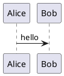
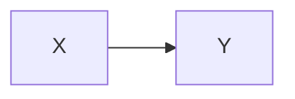

```plantuml user-flow
```
````

→ `diagrams/architecture/user-flow.png`

Without a title, files are named by type and sequence number: `plantuml-01.png`, `mermaid-01.png`, etc.

### Example

````md
# Architecture

```plantuml "Sequence Overview"
@startuml
...
@enduml
```

# diagram-render

Renders diagram source files to PNG using [Kroki](https://kroki.io). No runtime dependencies — uses only Node.js built-ins.

Two input modes:

- **Individual files** — one diagram per file, format detected from extension
- **Markdown files** — multiple diagrams embedded as fenced code blocks, each rendered to a sub-directory

## Quick start

```bash
# Drop source files into src/ then render all of them
npm run render
```

Output PNGs land in `diagrams/`.

## Usage

```bash
node generate.cjs [file] [options]
```

| Argument / Option    | Description                            | Default      |
|----------------------|----------------------------------------|--------------|
| `file`               | Single file to render (from input dir) | —            |
| `-i, --input <dir>`  | Source directory                       | `./src`      |
| `-o, --output <dir>` | Output directory                       | `./diagrams` |
| `-h, --help`         | Show help and supported formats        | —            |

### Examples

```bash
# Render everything in src/ → diagrams/
npm run render

# Render a single diagram file
npm run render:one -- flow.puml

# Render a single markdown file
npm run render:one -- architecture.md

# Custom input directory
node generate.cjs -i ./architecture

# Custom input and output
node generate.cjs -i ./architecture -o ./docs/images

# Single file with custom output
node generate.cjs flow.puml -o ./docs/images
```

## Individual diagram files

Format is detected from the file extension. Unsupported extensions are skipped.

| Extension(s)                    | Kroki type   |
|---------------------------------|--------------|
| `.puml`, `.plantuml`            | plantuml     |
| `.c4puml`                       | c4plantuml   |
| `.mmd`, `.mermaid`              | mermaid      |
| `.dot`, `.gv`                   | graphviz     |
| `.d2`                           | d2           |
| `.dbml`                         | dbml         |
| `.ditaa`                        | ditaa        |
| `.erd`                          | erd          |
| `.excalidraw`                   | excalidraw   |
| `.blockdiag`                    | blockdiag    |
| `.seqdiag`                      | seqdiag      |
| `.actdiag`                      | actdiag      |
| `.nwdiag`                       | nwdiag       |
| `.packetdiag`                   | packetdiag   |
| `.rackdiag`                     | rackdiag     |
| `.bpmn`                         | bpmn         |
| `.bytefield`                    | bytefield    |
| `.nomnoml`                      | nomnoml      |
| `.pikchr`                       | pikchr       |
| `.dsl`                          | structurizr  |
| `.bob`                          | svgbob       |
| `.symbolator`                   | symbolator   |
| `.tikz`                         | tikz         |
| `.vega`                         | vega         |
| `.vegalite`                     | vegalite     |
| `.wavedrom`                     | wavedrom     |
| `.wireviz`                      | wireviz      |

Output: `diagrams/flow.png` (same base filename as input).

To add a format, edit the `KROKI_TYPE` map in `generate.cjs`. Full list: https://kroki.io/#support

## Markdown files

Embed diagrams as fenced code blocks using the diagram type as the language name.
Each block is rendered individually and saved to a sub-directory named after the `.md` file.

### Title syntax

Add a title after the language name on the opening fence line. The title becomes the PNG filename.

**Quoted** — allows spaces, becomes the filename as-is:

````md

````

→ `diagrams/architecture/User Registration Flow.png`

**Unquoted slug** — single word or kebab-case:

````md




````

Output for `src/architecture.md`:

```txt
diagrams/
└── architecture/
    ├── Sequence Overview.png   ← quoted title
    ├── data-flow.png           ← unquoted slug
    └── mermaid-01.png          ← untitled fallback
```

### Supported code block language names

| Language name(s)                        | Kroki type   |
|-----------------------------------------|--------------|
| `plantuml`, `puml`                      | plantuml     |
| `c4plantuml`, `c4`                      | c4plantuml   |
| `mermaid`                               | mermaid      |
| `dot`, `graphviz`                       | graphviz     |
| `d2`                                    | d2           |
| `dbml`                                  | dbml         |
| `ditaa`                                 | ditaa        |
| `erd`                                   | erd          |
| `excalidraw`                            | excalidraw   |
| `blockdiag`                             | blockdiag    |
| `seqdiag`                               | seqdiag      |
| `actdiag`                               | actdiag      |
| `nwdiag`                                | nwdiag       |
| `packetdiag`                            | packetdiag   |
| `rackdiag`                              | rackdiag     |
| `bpmn`                                  | bpmn         |
| `bytefield`                             | bytefield    |
| `nomnoml`                               | nomnoml      |
| `pikchr`                                | pikchr       |
| `structurizr`                           | structurizr  |
| `svgbob`, `bob`                         | svgbob       |
| `symbolator`                            | symbolator   |
| `tikz`, `tex`                           | tikz         |
| `vega`                                  | vega         |
| `vegalite`, `vega-lite`                 | vegalite     |
| `wavedrom`                              | wavedrom     |
| `wireviz`                               | wireviz      |

To add a language alias, edit the `MARKDOWN_LANG` map in `generate.cjs`.

## Project structure

```txt
diagram-render/
├── generate.cjs        # renderer script
├── Makefile
├── docker-compose.yml
├── src/
│   ├── public/         # committed — shared diagrams
│   ├── private/        # gitignored — sensitive diagrams
│   └── *.puml / *.md   # root-level files also supported
└── diagrams/           # output mirrors src/ structure
    ├── public/         # committed
    └── private/        # gitignored
```

Sub-directory structure is mirrored from `src/` to `diagrams/` automatically:

```txt
src/public/flow.puml          →  diagrams/public/flow.png
src/private/secret.puml       →  diagrams/private/secret.png
src/public/arch.md            →  diagrams/public/arch/sequence.png
src/flow.puml                 →  diagrams/flow.png
```

## Local Kroki server

Run your own Kroki instance via Docker to avoid sending diagrams to the public server.

```bash
make          # show all commands and examples
make up       # start all containers (detached)
make down     # stop and remove containers
make restart  # restart containers
make status   # show container status

make render                                # render all diagrams in src/
make render FILE=public/flow.puml          # render a single file
make render DIR=src/public                 # render src/public → diagrams/public
make render DIR=src/private                # render src/private → diagrams/private
make render DIR=src/public OUT=out/pub     # override output directory
```

The server starts on `http://localhost:8000`. The script checks it automatically on every run — no flags needed:

```
Kroki: checking http://localhost:8000 ... ok
```

If the local server is not running, the script asks before falling back to `https://kroki.io`:

```
Kroki: checking http://localhost:8000 ... unavailable
Fall back to https://kroki.io? [y/N]
```

To skip the health check and force a specific server:

```bash
node generate.cjs --kroki-url http://localhost:8000
node generate.cjs --kroki-url https://kroki.io
```

Containers started by `docker-compose.yml`:

| Service      | Image                       | Covers                                           |
|--------------|-----------------------------|--------------------------------------------------|
| `kroki`      | yuzutech/kroki              | Core (PlantUML, C4, GraphViz, D2, Mermaid, etc.) |
| `mermaid`    | yuzutech/kroki-mermaid      | Mermaid                                          |
| `blockdiag`  | yuzutech/kroki-blockdiag    | BlockDiag, SeqDiag, ActDiag, NwDiag, PacketDiag, RackDiag |
| `bpmn`       | yuzutech/kroki-bpmn         | BPMN                                             |
| `excalidraw` | yuzutech/kroki-excalidraw   | Excalidraw                                       |
| `wireviz`    | yuzutech/kroki-wireviz      | WireViz                                          |

If you only need core types (PlantUML, GraphViz, D2, etc.) and not Mermaid/BPMN/Excalidraw/WireViz, you can remove the companion services from `docker-compose.yml` to save memory.

## Notes

- The script always tries `http://localhost:8000` first. If unavailable it asks before using `https://kroki.io`. Use `--kroki-url` to override and skip the health check.
- Non-diagram code blocks in `.md` files are silently skipped.
- Title slugs should be `kebab-case`. Quoted titles may contain spaces but avoid special shell characters.
