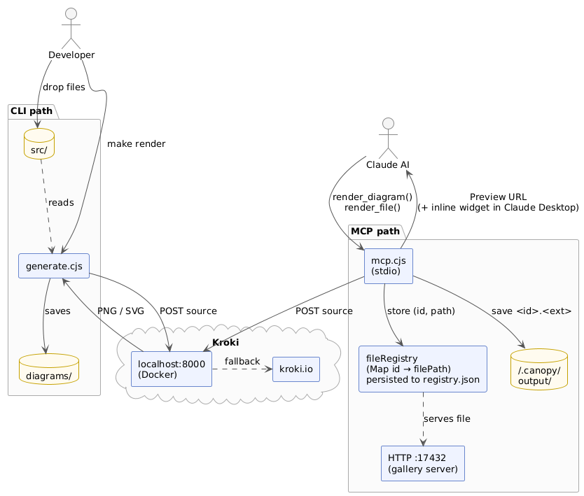
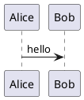

```plantuml user-flow
```
````

→ `diagrams/architecture/user-flow.png`

Without a title, files are named by type and sequence number: `plantuml-01.png`, `mermaid-01.png`, etc.

### Example

````md
# Architecture

```plantuml "Sequence Overview"
@startuml
...
@enduml
```

# Canopy

Renders diagram source files to PNG/SVG using [Kroki](https://kroki.io). No runtime dependencies — uses only Node.js built-ins.



Two usage modes:

- **CLI** — drop source files into `src/`, run `make render`, get images in `diagrams/`
- **MCP server** — AI tools (`render_diagram`, `render_file`) render on demand and return a one-click preview URL

---

## Quick start

```bash
make up        # start local Kroki (Docker)
make render    # render all files in src/ → diagrams/
```

Output lands in `diagrams/`.

---

## CLI usage

```bash
make render                                  # render everything in src/
make render FILE=public/flow.puml            # single file
make render DIR=src/public                   # subdirectory → diagrams/public/
make render DIR=src/public OUT=out/pub       # custom output directory
```

---

## Supported formats

Format is detected from the file extension. Unsupported extensions are skipped.

| Extension(s)                    | Kroki type   |
|---------------------------------|--------------|
| `.puml`, `.plantuml`            | plantuml     |
| `.c4puml`                       | c4plantuml   |
| `.mmd`, `.mermaid`              | mermaid      |
| `.dot`, `.gv`                   | graphviz     |
| `.d2`                           | d2           |
| `.dbml`                         | dbml         |
| `.ditaa`                        | ditaa        |
| `.erd`                          | erd          |
| `.excalidraw`                   | excalidraw   |
| `.blockdiag`                    | blockdiag    |
| `.seqdiag`                      | seqdiag      |
| `.actdiag`                      | actdiag      |
| `.nwdiag`                       | nwdiag       |
| `.packetdiag`                   | packetdiag   |
| `.rackdiag`                     | rackdiag     |
| `.bpmn`                         | bpmn         |
| `.bytefield`                    | bytefield    |
| `.nomnoml`                      | nomnoml      |
| `.pikchr`                       | pikchr       |
| `.dsl`                          | structurizr  |
| `.bob`                          | svgbob       |
| `.symbolator`                   | symbolator   |
| `.tikz`                         | tikz         |
| `.vega`                         | vega         |
| `.vegalite`                     | vegalite     |
| `.wavedrom`                     | wavedrom     |
| `.wireviz`                      | wireviz      |

To add a format, edit the `KROKI_TYPE` map in `generate.cjs`. Full list: https://kroki.io/#support

---

## Markdown files

Embed diagrams as fenced code blocks using the diagram type as the language name. Each block is rendered individually and saved to a sub-directory named after the `.md` file.

### Title syntax

Add a title after the language name on the opening fence line:

````md

````
→ `diagrams/architecture/User Registration Flow.png`

````md



````

Render a markdown file:

```bash
make render FILE=src/architecture.md
```

Output for `src/architecture.md`:

```
diagrams/
└── architecture/
    ├── Sequence Overview.png
    └── data-flow.png
```

---

## Project structure

```
canopy/
├── generate.cjs        # CLI renderer
├── mcp.cjs             # MCP server + HTTP preview server
├── lib/renderer.cjs    # shared rendering logic
├── Makefile
├── docker-compose.yml
├── src/
│   ├── public/         # committed — shared diagrams
│   └── private/        # gitignored — sensitive diagrams
└── diagrams/
    ├── public/         # committed
    └── private/        # gitignored
```

Sub-directory structure is mirrored from `src/` to `diagrams/` automatically:

```
src/public/flow.puml     →  diagrams/public/flow.png
src/public/arch.md       →  diagrams/public/arch/sequence.png
```

---

## Local Kroki server

Run your own Kroki instance via Docker to avoid sending diagrams to the public server.

```bash
make up        # start all containers (detached)
make down      # stop and remove containers
make restart   # restart containers
make status    # show container status
```

The script checks `http://localhost:8000` automatically on every run:

```
Kroki: checking http://localhost:8000 ... ok
```

If unavailable, it asks before falling back to `https://kroki.io`.

Containers started by `docker-compose.yml`:

| Service      | Image                       | Covers                                                     |
|--------------|-----------------------------|------------------------------------------------------------|
| `kroki`      | yuzutech/kroki              | Core (PlantUML, C4, GraphViz, D2, Mermaid, etc.)           |
| `mermaid`    | yuzutech/kroki-mermaid      | Mermaid                                                    |
| `blockdiag`  | yuzutech/kroki-blockdiag    | BlockDiag, SeqDiag, ActDiag, NwDiag, PacketDiag, RackDiag  |
| `bpmn`       | yuzutech/kroki-bpmn         | BPMN                                                       |
| `excalidraw` | yuzutech/kroki-excalidraw   | Excalidraw                                                 |
| `wireviz`    | yuzutech/kroki-wireviz      | WireViz                                                    |

---

## MCP server

The MCP server exposes diagram rendering as AI tools. It starts an HTTP file server on a fixed port 17432 alongside the MCP stdio transport.


**Available tools:**

| Tool | Description |
|------|-------------|
| `get_diagram_preferences` | Returns the format selection rules and visual style guide |
| `render_diagram` | Render diagram source text → returns a preview URL |
| `render_file` | Render a source file from disk → returns preview URL(s) |
| `list_supported_types` | List all supported Kroki types and extensions |

The preview URL (e.g. `http://127.0.0.1:17432/a1b2c3`) opens directly in your browser.

### Claude Code

Add globally so it's available in every project:

```bash
claude mcp add canopy -s user node /path/to/canopy/mcp.cjs
```

Or let Claude Code auto-discover it when you open this repo — `.mcp.json` is already included.

### Claude Desktop

Add to `~/Library/Application Support/Claude/claude_desktop_config.json`:

```json
{
  "mcpServers": {
    "canopy": {
      "command": "node",
      "args": ["/path/to/canopy/mcp.cjs"]
    }
  }
}
```

Restart Claude Desktop after editing. The MCP server starts automatically when the app launches.

---

## Notes

- `diagrams/private/` and `src/private/` are gitignored — use them for sensitive diagrams.
- Non-diagram code blocks in `.md` files are silently skipped.
- Rendered images are saved to `~/.canopy/output/` and persist across reboots. The registry is persisted to `~/.canopy/registry.json` and reloaded on each server start, so preview URLs remain valid indefinitely as long as the image file exists on disk.
- The MCP server ships a built-in diagram style guide (format selection rules, color system, layout defaults) injected automatically into supporting clients. To override or extend it, create `~/.canopy/preferences.md` — its contents are appended under a `USER PREFERENCES` section on every server start. In Claude Desktop, call `get_diagram_preferences` at the start of a chat to load the style guide manually.
