It is an **inferred architecture diagram from the code**, not a literal LangGraph-exported runtime graph.

```plantuml
@startuml
title Deep Agent assembly flow inferred from create_deep_agent(...)

skinparam shadowing false
skinparam packageStyle rectangle
skinparam linetype ortho

start

:Input params to create_deep_agent(...);

if (model is None?) then (yes)
  :model = get_default_model();
else (no)
  :model = resolve_model(model);
endif

if (backend is None?) then (yes)
  :backend = StateBackend;
else (no)
  :use provided backend;
endif

partition "Build general-purpose subagent spec" {
  :gp_middleware = [
    TodoListMiddleware,
    FilesystemMiddleware(backend),
    SummarizationMiddleware(model, backend),
    AnthropicPromptCachingMiddleware,
    PatchToolCallsMiddleware
  ];

  if (skills provided?) then (yes)
    :append SkillsMiddleware(backend, skills);
  endif

  if (interrupt_on provided?) then (yes)
    :append HumanInTheLoopMiddleware(interrupt_on);
  endif

  :general_purpose_spec = GENERAL_PURPOSE_SUBAGENT
  + model
  + (tools or [])
  + gp_middleware;
}

partition "Process user subagents" {
  :processed_subagents = [];

  while (more subagent specs?) is (yes)
    :read next spec;

    if ("runnable" in spec?) then (yes)
      :CompiledSubAgent;
      :append as-is to processed_subagents;
    else (no)
      :subagent_model = spec.model or main model;
      :subagent_model = resolve_model(subagent_model);

      :subagent_middleware = [
        TodoListMiddleware,
        FilesystemMiddleware(backend),
        SummarizationMiddleware(subagent_model, backend),
        AnthropicPromptCachingMiddleware,
        PatchToolCallsMiddleware
      ];

      if (spec.skills provided?) then (yes)
        :append SkillsMiddleware(backend, spec.skills);
      endif

      :append spec.middleware (if any);

      :processed_spec = spec
      + model=subagent_model
      + tools=(spec.tools or tools or [])
      + middleware=subagent_middleware;

      :append processed_spec to processed_subagents;
    endif
  endwhile (no)
}

:all_subagents = [general_purpose_spec] + processed_subagents;

partition "Build main deep-agent middleware stack" {
  :deepagent_middleware = [
    TodoListMiddleware
  ];

  if (memory provided?) then (yes)
    :append MemoryMiddleware(backend, memory);
  endif

  if (skills provided?) then (yes)
    :append SkillsMiddleware(backend, skills);
  endif

  :append [
    FilesystemMiddleware(backend),
    SubAgentMiddleware(backend, all_subagents),
    SummarizationMiddleware(model, backend),
    AnthropicPromptCachingMiddleware,
    PatchToolCallsMiddleware
  ];

  if (extra middleware provided?) then (yes)
    :append user middleware;
  endif

  if (interrupt_on provided?) then (yes)
    :append HumanInTheLoopMiddleware(interrupt_on);
  endif
}

partition "Compose system prompt" {
  if (system_prompt is None?) then (yes)
    :final_system_prompt = BASE_AGENT_PROMPT;
  else (no)
    if (system_prompt is SystemMessage?) then (yes)
      :append BASE_AGENT_PROMPT as text block;
    else (string)
      :final_system_prompt = system_prompt + BASE_AGENT_PROMPT;
    endif
  endif
}

partition "Create compiled agent graph" {
  :create_agent(
    model,
    system_prompt=final_system_prompt,
    tools=tools,
    middleware=deepagent_middleware,
    response_format=response_format,
    context_schema=context_schema,
    checkpointer=checkpointer,
    store=store,
    debug=debug,
    name=name,
    cache=cache
  );

  :with_config({recursion_limit: 1000});
}

stop
@enduml
```



And here’s a **component-style PlantUML** version, which is often better for understanding the nesting and middleware composition:

```c4plantuml "Deep Agent System Architecture"
@startuml
!include https://raw.githubusercontent.com/plantuml-stdlib/C4-PlantUML/master/C4_Component.puml

title Deep Agent Architecture

Container_Boundary(deep_agent, "Deep Agent") {

  Component(main_agent, "Main Agent", "LangChain Agent")

  Component(todo, "TodoListMiddleware")
  Component(memory, "MemoryMiddleware")
  Component(skills, "SkillsMiddleware")
  Component(fs, "FilesystemMiddleware")
  Component(subagent_mw, "SubAgentMiddleware")
  Component(sum, "SummarizationMiddleware")
  Component(cache, "PromptCachingMiddleware")
  Component(patch, "PatchToolCallsMiddleware")
  Component(hitl, "HumanInTheLoopMiddleware")

}

Container_Boundary(subagents, "Subagents") {

  Component(gp_subagent, "General Purpose SubAgent")

  Component(gp_todo, "TodoListMiddleware")
  Component(gp_fs, "FilesystemMiddleware")
  Component(gp_sum, "SummarizationMiddleware")
  Component(gp_cache, "PromptCachingMiddleware")
  Component(gp_patch, "PatchToolCallsMiddleware")

}

main_agent --> todo
main_agent --> memory
main_agent --> skills
main_agent --> fs
main_agent --> subagent_mw
main_agent --> sum
main_agent --> cache
main_agent --> patch
main_agent --> hitl

subagent_mw --> gp_subagent

gp_subagent --> gp_todo
gp_subagent --> gp_fs
gp_subagent --> gp_sum
gp_subagent --> gp_cache
gp_subagent --> gp_patch

@enduml
```

The **actual conceptual runtime shape** is basically:

```text
Main Agent
 ├─ TodoListMiddleware
 ├─ MemoryMiddleware?
 ├─ SkillsMiddleware?
 ├─ FilesystemMiddleware
 ├─ SubAgentMiddleware
 │   ├─ General-purpose subagent
 │   │   ├─ TodoList
 │   │   ├─ Filesystem
 │   │   ├─ Summarization
 │   │   ├─ PromptCaching
 │   │   ├─ PatchToolCalls
 │   │   ├─ Skills?
 │   │   └─ HumanInTheLoop?
 │   └─ User-defined subagents...
 ├─ SummarizationMiddleware
 ├─ PromptCachingMiddleware
 ├─ PatchToolCallsMiddleware
 ├─ extra middleware?
 └─ HumanInTheLoop?
```

A few fidelity notes so you don’t overread the diagram:

- This code is a **factory/assembler**, not an explicit LangGraph node-edge definition.
- The most graph-like element here is **`SubAgentMiddleware`**, which delegates to a set of subagents.
- `create_agent(...)` likely creates the real compiled LangGraph internally, but that graph is **not directly visible in this snippet**.
- So this PlantUML is best read as **composition + control flow**, not exact internal node topology.

Paste either block into any PlantUML renderer. The second one is usually better for repo comprehension. If you want, I can turn this into a **true nested activity diagram with `fork` blocks** to make subagent assembly even more visually compact.
