It is an **inferred architecture diagram from the code**, not a literal LangGraph-exported runtime graph.

```plantuml
@startuml
title Deep Agent assembly flow inferred from create_deep_agent(...)

skinparam shadowing false
skinparam packageStyle rectangle
skinparam linetype ortho

start

:Input params to create_deep_agent(...);

if (model is None?) then (yes)
  :model = get_default_model();
else (no)
  :model = resolve_model(model);
endif

if (backend is None?) then (yes)
  :backend = StateBackend;
else (no)
  :use provided backend;
endif

partition "Build general-purpose subagent spec" {
  :gp_middleware = [
    TodoListMiddleware,
    FilesystemMiddleware(backend),
    SummarizationMiddleware(model, backend),
    AnthropicPromptCachingMiddleware,
    PatchToolCallsMiddleware
  ];

  if (skills provided?) then (yes)
    :append SkillsMiddleware(backend, skills);
  endif

  if (interrupt_on provided?) then (yes)
    :append HumanInTheLoopMiddleware(interrupt_on);
  endif

  :general_purpose_spec = GENERAL_PURPOSE_SUBAGENT
  + model
  + (tools or [])
  + gp_middleware;
}

partition "Process user subagents" {
  :processed_subagents = [];

  while (more subagent specs?) is (yes)
    :read next spec;

    if ("runnable" in spec?) then (yes)
      :CompiledSubAgent;
      :append as-is to processed_subagents;
    else (no)
      :subagent_model = spec.model or main model;
      :subagent_model = resolve_model(subagent_model);

      :subagent_middleware = [
        TodoListMiddleware,
        FilesystemMiddleware(backend),
        SummarizationMiddleware(subagent_model, backend),
        AnthropicPromptCachingMiddleware,
        PatchToolCallsMiddleware
      ];

      if (spec.skills provided?) then (yes)
        :append SkillsMiddleware(backend, spec.skills);
      endif

      :append spec.middleware (if any);

      :processed_spec = spec
      + model=subagent_model
      + tools=(spec.tools or tools or [])
      + middleware=subagent_middleware;

      :append processed_spec to processed_subagents;
    endif
  endwhile (no)
}

:all_subagents = [general_purpose_spec] + processed_subagents;

partition "Build main deep-agent middleware stack" {
  :deepagent_middleware = [
    TodoListMiddleware
  ];

  if (memory provided?) then (yes)
    :append MemoryMiddleware(backend, memory);
  endif

  if (skills provided?) then (yes)
    :append SkillsMiddleware(backend, skills);
  endif

  :append [
    FilesystemMiddleware(backend),
    SubAgentMiddleware(backend, all_subagents),
    SummarizationMiddleware(model, backend),
    AnthropicPromptCachingMiddleware,
    PatchToolCallsMiddleware
  ];

  if (extra middleware provided?) then (yes)
    :append user middleware;
  endif

  if (interrupt_on provided?) then (yes)
    :append HumanInTheLoopMiddleware(interrupt_on);
  endif
}

partition "Compose system prompt" {
  if (system_prompt is None?) then (yes)
    :final_system_prompt = BASE_AGENT_PROMPT;
  else (no)
    if (system_prompt is SystemMessage?) then (yes)
      :append BASE_AGENT_PROMPT as text block;
    else (string)
      :final_system_prompt = system_prompt + BASE_AGENT_PROMPT;
    endif
  endif
}

partition "Create compiled agent graph" {
  :create_agent(
    model,
    system_prompt=final_system_prompt,
    tools=tools,
    middleware=deepagent_middleware,
    response_format=response_format,
    context_schema=context_schema,
    checkpointer=checkpointer,
    store=store,
    debug=debug,
    name=name,
    cache=cache
  );

  :with_config({recursion_limit: 1000});
}

stop
@enduml
```



And here’s a **component-style PlantUML** version, which is often better for understanding the nesting and middleware composition:

```plantuml
@startuml
title Deep Agent component structure inferred from create_deep_agent(...)

skinparam shadowing false
skinparam packageStyle rectangle
skinparam linetype ortho

package "create_deep_agent(...)" {

  component "Model resolution" as ModelResolution
  component "Backend resolution" as BackendResolution
  component "System prompt composition" as PromptComposition
  component "create_agent(...)\n.with_config(recursion_limit=1000)" as CreateAgent

  package "General-purpose subagent" {
    component "GENERAL_PURPOSE_SUBAGENT spec" as GPSpec

    package "GP middleware stack" {
      component "TodoListMiddleware" as GP_Todo
      component "FilesystemMiddleware" as GP_FS
      component "SummarizationMiddleware" as GP_Sum
      component "AnthropicPromptCachingMiddleware" as GP_Cache
      component "PatchToolCallsMiddleware" as GP_Patch
      component "SkillsMiddleware\n(optional)" as GP_Skills
      component "HumanInTheLoopMiddleware\n(optional)" as GP_HITL
    }
  }

  package "User subagent processing" {
    component "Iterate subagents[]" as ProcessLoop
    component "CompiledSubAgent\n(pass through)" as CompiledSub
    component "Resolve subagent model" as SubModelResolve
    component "Processed SubAgent spec" as ProcessedSubSpec

    package "Per-subagent base middleware" {
      component "TodoListMiddleware" as SUB_Todo
      component "FilesystemMiddleware" as SUB_FS
      component "SummarizationMiddleware" as SUB_Sum
      component "AnthropicPromptCachingMiddleware" as SUB_Cache
      component "PatchToolCallsMiddleware" as SUB_Patch
      component "SkillsMiddleware\n(optional per subagent)" as SUB_Skills
      component "User subagent middleware\n(optional)" as SUB_UserMW
    }
  }

  component "all_subagents =\n[general_purpose_spec] + processed_subagents" as AllSubagents

  package "Main deep agent" {
    package "Main middleware stack" {
      component "TodoListMiddleware" as MAIN_Todo
      component "MemoryMiddleware\n(optional)" as MAIN_Memory
      component "SkillsMiddleware\n(optional)" as MAIN_Skills
      component "FilesystemMiddleware" as MAIN_FS
      component "SubAgentMiddleware" as MAIN_SubAgent
      component "SummarizationMiddleware" as MAIN_Sum
      component "AnthropicPromptCachingMiddleware" as MAIN_Cache
      component "PatchToolCallsMiddleware" as MAIN_Patch
      component "Extra user middleware\n(optional)" as MAIN_UserMW
      component "HumanInTheLoopMiddleware\n(optional)" as MAIN_HITL
    }
  }
}

ModelResolution --> GPSpec
BackendResolution --> GPSpec

GP_Todo --> GPSpec
GP_FS --> GPSpec
GP_Sum --> GPSpec
GP_Cache --> GPSpec
GP_Patch --> GPSpec
GP_Skills --> GPSpec
GP_HITL --> GPSpec

ProcessLoop --> CompiledSub
ProcessLoop --> SubModelResolve
SubModelResolve --> ProcessedSubSpec

SUB_Todo --> ProcessedSubSpec
SUB_FS --> ProcessedSubSpec
SUB_Sum --> ProcessedSubSpec
SUB_Cache --> ProcessedSubSpec
SUB_Patch --> ProcessedSubSpec
SUB_Skills --> ProcessedSubSpec
SUB_UserMW --> ProcessedSubSpec

GPSpec --> AllSubagents
CompiledSub --> AllSubagents
ProcessedSubSpec --> AllSubagents

AllSubagents --> MAIN_SubAgent

MAIN_Todo --> CreateAgent
MAIN_Memory --> CreateAgent
MAIN_Skills --> CreateAgent
MAIN_FS --> CreateAgent
MAIN_SubAgent --> CreateAgent
MAIN_Sum --> CreateAgent
MAIN_Cache --> CreateAgent
MAIN_Patch --> CreateAgent
MAIN_UserMW --> CreateAgent
MAIN_HITL --> CreateAgent

PromptComposition --> CreateAgent
ModelResolution --> CreateAgent
BackendResolution --> CreateAgent
@enduml
```



The **actual conceptual runtime shape** is basically:

```text
Main Agent
 ├─ TodoListMiddleware
 ├─ MemoryMiddleware?
 ├─ SkillsMiddleware?
 ├─ FilesystemMiddleware
 ├─ SubAgentMiddleware
 │   ├─ General-purpose subagent
 │   │   ├─ TodoList
 │   │   ├─ Filesystem
 │   │   ├─ Summarization
 │   │   ├─ PromptCaching
 │   │   ├─ PatchToolCalls
 │   │   ├─ Skills?
 │   │   └─ HumanInTheLoop?
 │   └─ User-defined subagents...
 ├─ SummarizationMiddleware
 ├─ PromptCachingMiddleware
 ├─ PatchToolCallsMiddleware
 ├─ extra middleware?
 └─ HumanInTheLoop?
```

A few fidelity notes so you don’t overread the diagram:

- This code is a **factory/assembler**, not an explicit LangGraph node-edge definition.
- The most graph-like element here is **`SubAgentMiddleware`**, which delegates to a set of subagents.
- `create_agent(...)` likely creates the real compiled LangGraph internally, but that graph is **not directly visible in this snippet**.
- So this PlantUML is best read as **composition + control flow**, not exact internal node topology.

Paste either block into any PlantUML renderer. The second one is usually better for repo comprehension. If you want, I can turn this into a **true nested activity diagram with `fork` blocks** to make subagent assembly even more visually compact.
