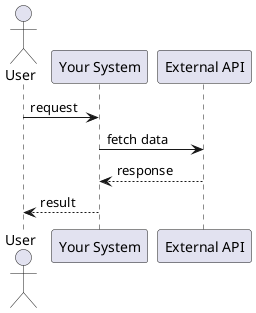
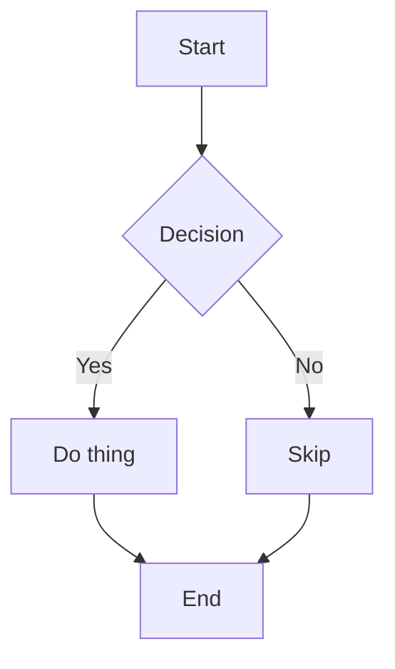

# Example — multiple diagrams in one markdown file

## Sequence diagram

```plantuml
@startuml
actor User
participant "Your System" as S
participant "External API" as API

User -> S: request
S -> API: fetch data
API --> S: response
S --> User: result
@enduml
```

## Flow diagram

```mermaid
graph TD
    A[Start] --> B{Decision}
    B -- Yes --> C[Do thing]
    B -- No --> D[Skip]
    C --> E[End]
    D --> E
```
