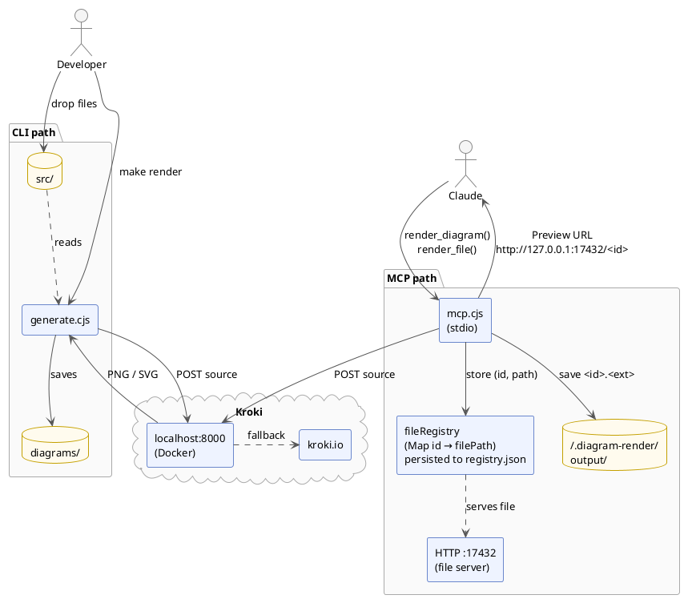
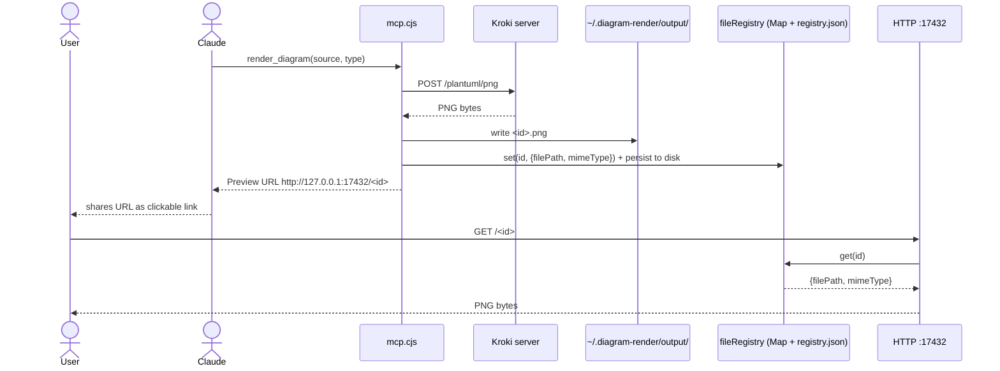

# Architecture

```plantuml "overview"
@startuml
!theme plain
skinparam backgroundColor white
skinparam defaultFontSize 13
skinparam componentStyle rectangle
skinparam ArrowColor #555555
skinparam ComponentBackgroundColor #EEF3FF
skinparam ComponentBorderColor #6B87CC
skinparam DatabaseBackgroundColor #FFFBEE
skinparam DatabaseBorderColor #C4A000
skinparam PackageBorderColor #AAAAAA
skinparam PackageBackgroundColor #FAFAFA
skinparam ActorBackgroundColor #F5F5F5
skinparam ActorBorderColor #888888
skinparam NoteBackgroundColor #FFFDE7
skinparam NoteBorderColor #BBBB00

top to bottom direction

actor "Developer" as dev
actor "Claude" as ai

package "CLI path" {
  database "src/" as src
  component "generate.cjs" as cli
  database "diagrams/" as out
}

package "MCP path" {
  component "mcp.cjs\n(stdio)" as mcp
  component "fileRegistry\n(Map id → filePath)\npersisted to registry.json" as reg
  database "~/.diagram-render/\noutput/" as store
  component "HTTP :17432\n(file server)" as http
}

cloud "Kroki" as kroki {
  component "localhost:8000\n(Docker)" as local
  component "kroki.io" as pub
}

dev --> src : drop files
dev --> cli : make render
src ..> cli : reads
cli --> local : POST source
local .> pub : fallback
local --> cli : PNG / SVG
cli --> out : saves

ai --> mcp : render_diagram()\nrender_file()
mcp --> local : POST source
mcp --> store : save <id>.<ext>
mcp --> reg : store (id, path)
reg ..> http : serves file
mcp --> ai : Preview URL\nhttp://127.0.0.1:17432/<id>
@enduml
```

```mermaid "mcp-flow"
sequenceDiagram
    actor User
    actor Claude
    participant MCP as mcp.cjs
    participant Kroki as Kroki server
    participant Store as ~/.diagram-render/output/
    participant Reg as fileRegistry (Map + registry.json)
    participant HTTP as HTTP :17432

    Claude->>MCP: render_diagram(source, type)
    MCP->>Kroki: POST /plantuml/png
    Kroki-->>MCP: PNG bytes
    MCP->>Store: write <id>.png
    MCP->>Reg: set(id, {filePath, mimeType}) + persist to disk
    MCP-->>Claude: Preview URL http://127.0.0.1:17432/<id>
    Claude-->>User: shares URL as clickable link
    User->>HTTP: GET /<id>
    HTTP->>Reg: get(id)
    Reg-->>HTTP: {filePath, mimeType}
    HTTP-->>User: PNG bytes
```
